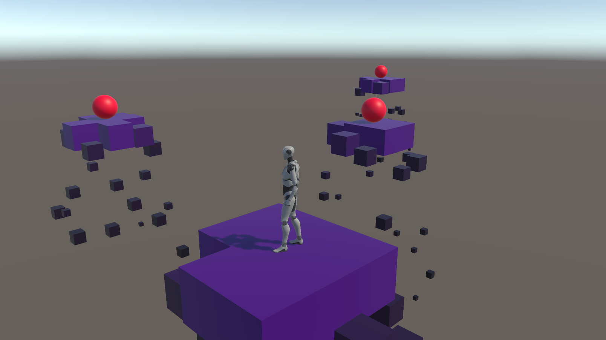
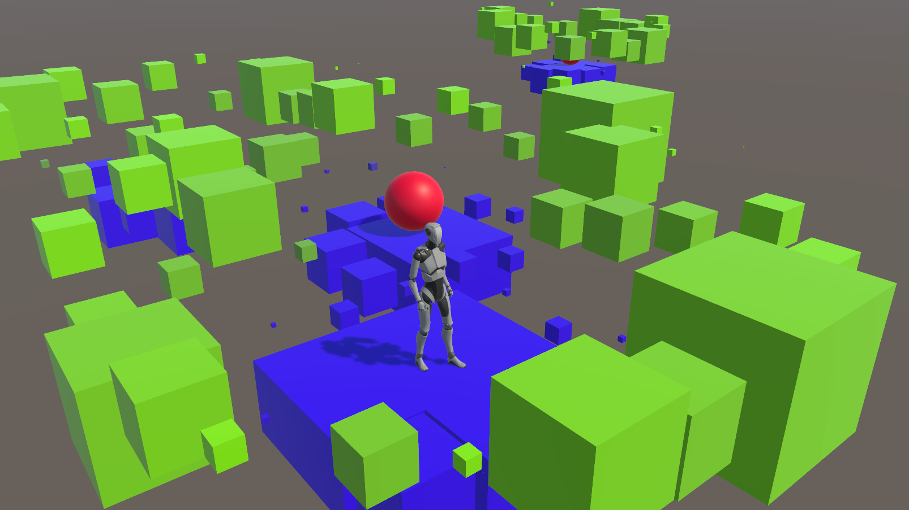
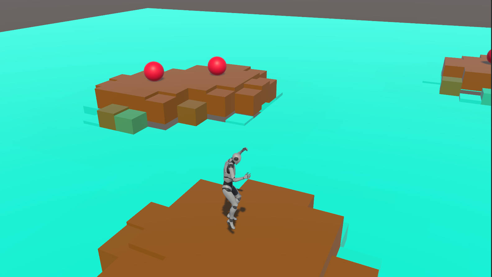
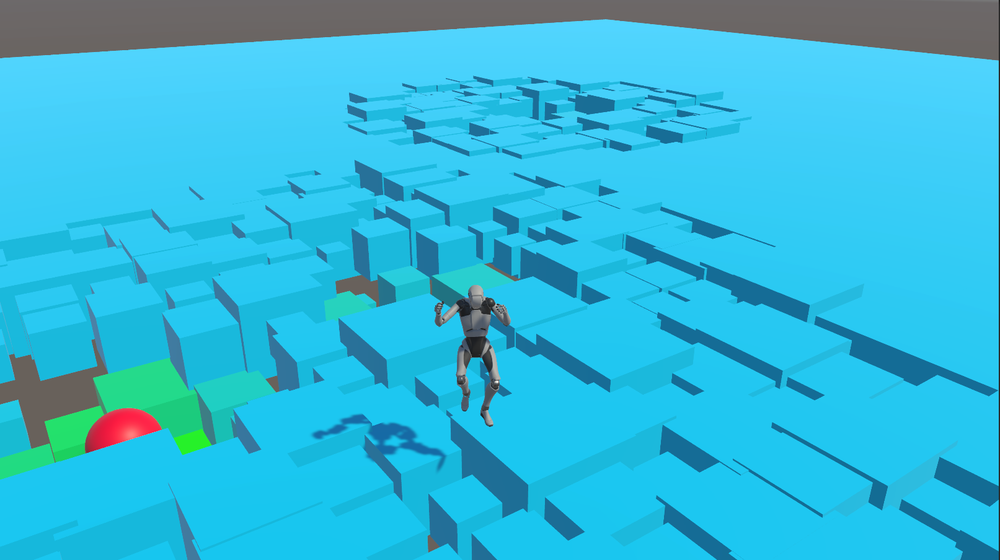

# MANNEQUIN PLAYGROUND
I made this project initially to check out the new mannequin by unity in 2021.1.
I ended up creating an interactive ground that reacts to certain objects and the distance from them

Here you can see examples of maps I created

And here are the various settings that a map uses

